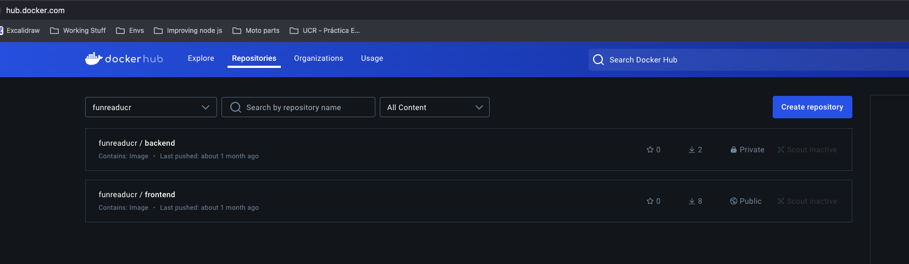
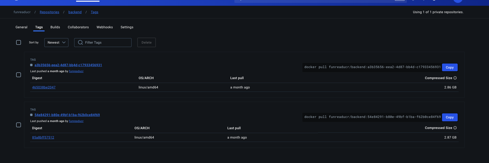
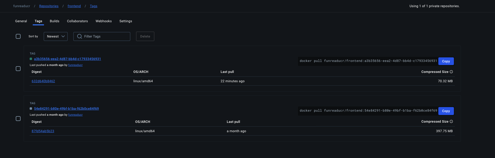
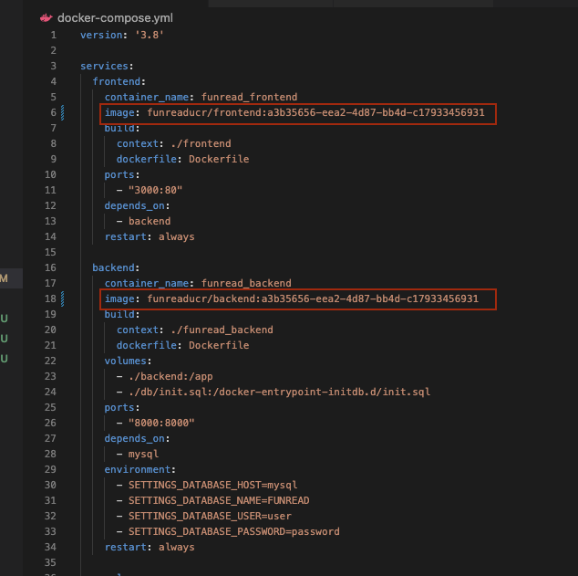
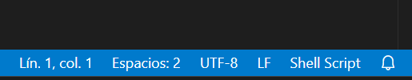

# FUNREAD

## Correr app usando Docker

Actualmente la plataforma cuenta con la habilidad de correrse utilizando docker containers. Cada uno de los servicios están definidos en el `docker-compose.yml` en el root directory del projecto. Los servicios definidos por el momento son `frontend`, `backend` y `mysql` respectivamente. Las imágenes que se utilizan para correr los dos primeros son `funreaducr/backend:main` y `funreaducr/frontend:main`.

Se agregaron steps en github actions con el fin de que se generen nuevos tags (ver archivo `.github/workflows/docker-publish.yml` para entender el proceso). Cada vez que se hace push al PR abierto o bien, se hace merge del PR a main se corre este proceso y se crean nuevos tags en nuestro docker hub (https://hub.docker.com/). Los credenciales para acceder a este hub son los siguientes:

* **username**: funreaducr
* **password**: Funread1234

Una vez se ingresa se pueden ver los tags creados basados en los pushes o merges. Los pushes generan GUIDs como tags. Los merges a main generan el tag `main` el cual se va a ir sobreescribiendo.

Si se desea probar un tag en especifico, se puede copiar el mismo y pegarlo en el `docker-compose.yml`, como se muestra en la siguiente imagen. Una vez copiado se puede correr la aplicación con docker (Ver sección `Ejecución`)

### Requerimientos

* Instalar Docker Desktop (la versión puede ser la más reciente, no afecta por el momento)
* Correr `docker -v` para verificar que se instaló correctamente

### Ejecución

* **docker compose build**: Permite hacer build de la imagenes con los cambios locales y los guarda localmente con el tag especificado en el `docker-compose.yml` para cada uno de los services.
* **docker compose up**: Levanta la aplicación en docker haciendo pull de los tags especificados en `docker-compose.yml`.

### Consideraciones
Docker en ocasiones no reconoce el archivo entrypoint.sh y esto evita que se inicialice algún servicio como el de backend por ejemplo, una posible solución si te ocurre ese error es cambiar la secuencia de fin de linea de CRLF a LF en el archivo entrypoint y luego guardar en el mismo, luego volver a construir la imagen con las instrucciones de (Ejecución).

### Comandos utiles

Para eliminar volumenes y imagenes huerfanas (usar solo si deseas hacer limpieza de todo)
`docker system prune -a --volumes --force`

Para coenxiones sin uso (usar solo si deseas hacer limpieza de todo)
`docker network prune --force`

Ver la versión de Docker
`docker --version`

Listar todos los contenedores (en ejecución):
`docker ps`

Listar todos los contenedores (incluyendo los detenidos):
`docker ps -a`